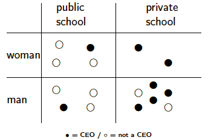
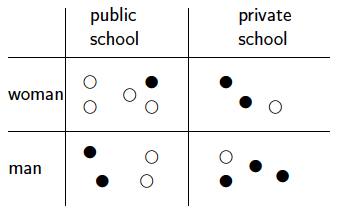
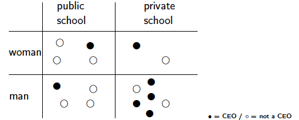
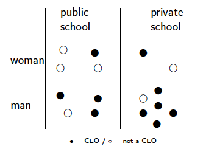
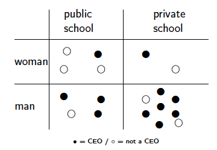
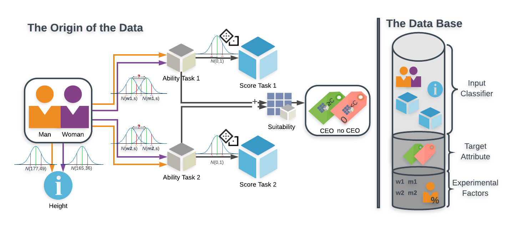
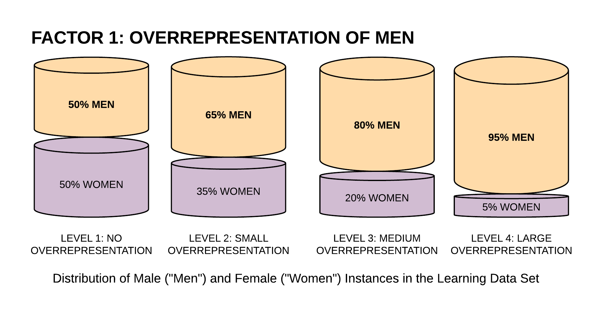
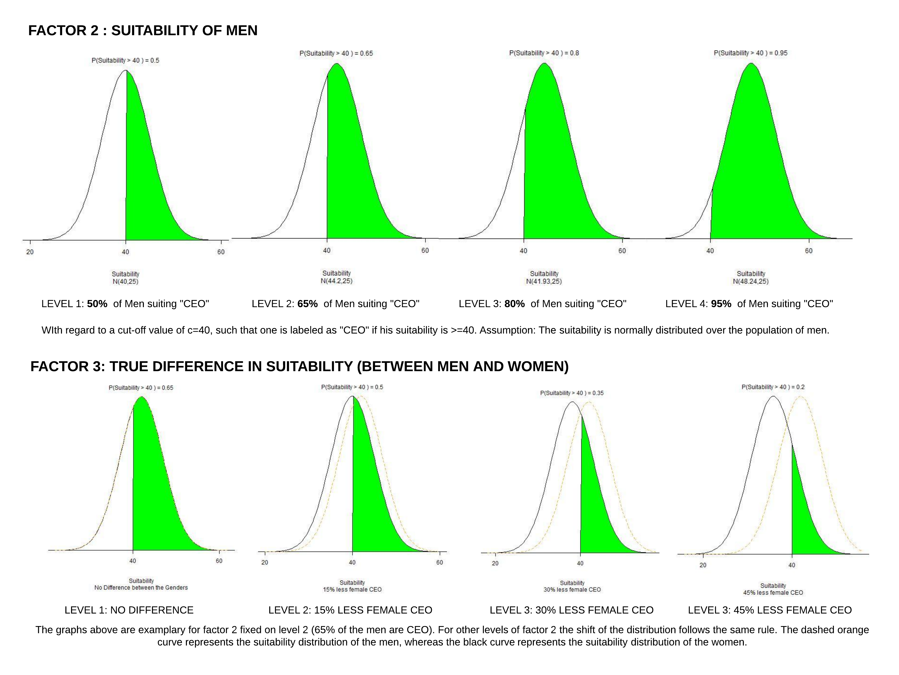

# About the project 

## WHO are we?
We are BIASpects! Three graduate students of the Otto-von-Guericke University in Magdeburg (Germany). Two of us are majoring in Digital Engineering and one in Statistics. 

## WHAT are we going to do?
We are going to do a simulation study where we simulate datasets with different kind of biases and train common classifier on these various datasets.

## WHY are we gonna that?
The last semester all of us three attended the workshop Responsible Data Science at the university. We got there basic knowledge and skills to audit a machine learning classification models for fairness and bias. Now we wanna strengthen and expand this knowlegde with the help of our project.

#### If you are still interested in our work you can follow the weekly progress and our outcomes here on this webpage. 

[Week 1](#1) | [Week 2](#2) | [Week 3](#3) | [Week 4](#4)

# WEEK 1: Experimental setting and first hypotheses 
Here to come: Our first report about the current state of our project. 
As reported earlier our approach aims to research on biases in decisive machine learning systems in an experimental way. By controlled variation of some potential origins of those biases, we first of all will try to figure out what kind of imbalances as well in the population as in the sample have an impact on the performance of the decision learner. In a second step a variation of methods to control for these biases will be tested. Will it be possible to detect sources of biases and potential tools to avoid or overcome them?
First of all, we will focus on the bias detection part. We will give you an overview on the planned setting and on the factors that will form our experimental groups. We hope that the overview gives you an understanding of our planned project and are open to all kind of feedback or questions on it.

## THE SETTING: 
In the experiment we will create artificial data sets. Included features will be: a binary group membership feature (population1 or population2), a binary target variable (0 or 1)(which will function as target variable for the classifier) and 1 to (?) features that somehow (?, we are still figuring this part out) correlate with the target variable (without any moderation through the group membership). In the actual version of factors, the experiment will have 4x4x4 different data sets (experimental groups). On those data sets binary classifiers (probably a SVM and a simple MLP) will be learned. Their performance will be compared on all experimental groups based on their specificity and sensitivity variations between population1 and population2.

#### Variation-Factor 1: Population representation in the sample
We will vary how many percent of the data set belongs to population1.
Planned Factor Levels (4): 50%, 65%, 80%, 95%

#### Variation-Factor 2: Probability of target in the population
The target variable will be sampled from a binomial distribution [Bin(1,p)]. F2 represents "p1" in the sense that the target variable is Bin(1,p1) for population1.
Planned Factor Levels (4): 0.5, 0.65, 0.8, 0.95

[Remark: This factor represents how much information about the target value the knowledge of "the instance belongs to population1" holds.]

#### Variation-Factor 3: Shift of the target variable distribution
The target variable for population2 will be sampled from Bin(1,p2). F3 represents "p2" and will be calculated depending on "p1". Calculation: p2=F3*p1
Planned Factor Levels (4): 1, 0.75, 0.5, 0.25

[Remark: This factor either represent that there is no difference in the underlying distributions or a small to big difference.]

#### Major bias (target) variable: Deviation of specificity
Specificity will be measured separately for population1 and population2 on each data set (for each experimental group). Deviation of specificity will be calculated as follows: Specificity of population2 - Specificity of population1.

#### Minor bias (target) variable: Deviation of sensitivity
Sensitivity will be measured separately for population1 and population2 on each data set (for each experimental group). Deviation of sensitivity will be calculated as follows: Sensitivity of population2 - Sensitivity of population1.

## OUR HYPOTHESES:
A bit way out of order, we now will also give you a short overview on the underlying hypotheses that will be tested with the experiment (in some way [we will concretise that in the further process]).

#### Hypothesis 1: 
If there is no real difference between (two) populations regarding the target variable, there will be no bias in a classifiers performance in any direction.

#### Hypothesis 2: 
If each (of two) population is represented equally in a learning data set of a (binary) classifier, there will be no bias in the classifiers performance in any direction, independent of probable differences between the (two) populations regarding the target variable.

#### Hypothesis 3:
If one population (out of two) is overrepresented in a learning data set of a (binary) classifier, its underlying distribution of the target variable will impact the performance of the classifier on the whole learning data set. The sensitivity or specificity for the underrepresented population will be worse.

This depends as well on the magnitude of the distribution shift (the greater the shift the higher the loss of sensitivity/specificity) [Hypothesis 3.1]

as on the direction of the distribution shift (in the case of an underlying binomial distribution of the target variable: If p1 (of population 1) < p2 (of population 2) the sensitivity will worsen. If p2 > p1 the specificity will worsen) [Hypothesis 3.2]

as on the magnitude of overrepresentation (the higher the percentage of the overrepresented population the higher the deterioration of sensitivity/specificity for the underrepresented population). [Hypothesis 3.3]

#### Hypothesis 4:
All the effects described in Hypotheses 3 are moderated by the informativeness of the population membership on the target variable. (In the case of an underlying binomial distribution of the target variable: The further away the p (of the overrepresented population) is from 0.5, the greater the described biases.)

[∆top](#0)

# WEEK 2: Improvement, expandation and graphical visualization of our hypotheses 

This week, we've expanded our hypotheses and developed a graphical visualization to make them easier to understand for outsiders. In the following graphics we used the label "CEO" or "not a CEO", the sensitive variable "woman" or "man" and the feature "public school" or "private school".

## Hypothesis 1:
No difference between the populations' underlying label distribution -> No bias.

## Hypothesis 2:
Equal population representation -> No bias. 
(even if there is a difference regarding the underlying label distribution)

## Hypothesis 3:
Population overrepresentation -> Bias.
The sensitivity or specificity for the underrepresented population will be worse.

### Hypothesis 3.1:
The greater the shift between the populations regarding the underlying label distribution, the higher the loss of sensitivity/specificity for the underrepresented one.

### Hypothesis 3.2:
The higher the overrepresentation of one population, the higher the bias.

## Hypothesis 4:
Exclusion of the sensitive variable will not reduce the bias.

## Hypothesis 5:
Different classification algorithms are differently vulnerable for bias.

[∆top](#0)

# WEEK 3: Kickoff presentation 
This week, we presented our project to our professor and his colleagues ([here you can find our presentation slides](../docs/KickoffBIASpect.pdf)), who are supervising the project. We got a lot of feedback and could select some points for rethinking regarding the conception of the data base and the experimental structure:

## How to sample the instances properties? We will need more dispersion!
So far, as described above, our plan was to have only binary variables in the learning data set. For the label and the gender this seems reasonable. For the variable which shall have a dependency with the label "CEO" or "NOT CEO" this could be realistic, too. Imagine you do a suitability test and pass it or not. Imagine that if you pass this test, it is probable that you could be a CEO. So the information if you passed the test or not (a binary variable) would be informative. But for the issue of our study for most of the classifiers this could be to easy to hard-learn this rule. So our mission: Find a way to sample a variable structure that correltes as well with the gender as with the label. One fix idea: Variables sampled from normal distributions.

## What kind of classifiers do we want to test? Don't be too sparingly!
So far, we were not sure, which classifiers we would test exactly. We collected a list of various and commonly used ones. As we discussed expected running times during the presentation we came along that there is no reason to not test the bias-effects on all classifiers that seem reasonable. No need to leave one out! Suggestions for additional classifiers are welcome.

## Which factors do we want to vary? More variations, more information. But keep it simple.
So far, as described above, the plan was to 1) vary the overrepresentation of men in the data set, 2) vary the distribution of the label for men and 3) vary the shift between the labeldistributions for men and women. The idea came up, if 2) is a necessary variation for our issue. Quickly this idea was discarded. Variations that could have an effect on the bias certainly should be varied in our experiment to monitor their influence.

Next to come: We will now start to rethink our data sampling and give it a look. In Mid-October we will have a meeting with our professor (who is inter alia an expert for neural networks and in general AI) and a professor from the simulations department. We are looking forward to finish our work on sampling with them.

[∆top](#0)

# WEEK 4: The new data set 

This week we worked on the creation of our dataset. Let's have a look:

And now let's take a look at our variational factors again:

[∆top](#0)

